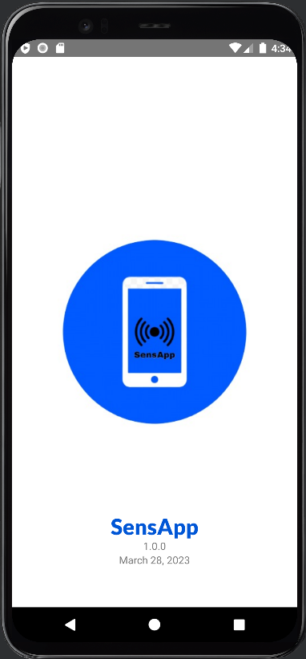
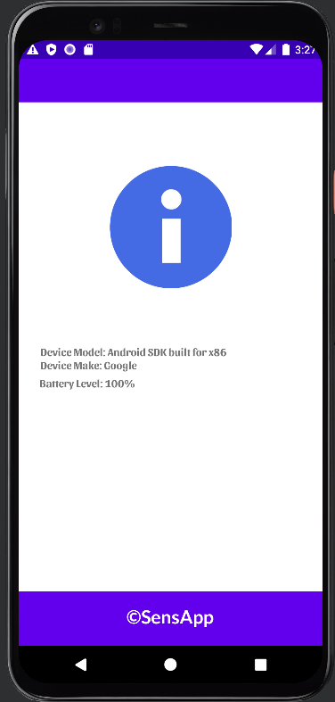

# **SensApp**
---

## **Introduction**

The aim of this report is to outline the development of an android app SensApp that utilizes the built-in sensors of mobile devices to measure and relay the data to the user and also displays the current Device information. This app provides users with the option to change the units of 
measurement and to save and view the sensor data. The app includes a splash screen with logo, title, version number and release date, hub activity with Sensor values, Available Sensors, Device Information and a user guide. 
The report presents a logical flow of the app's activities, along with screenshots and captions for each activity. The app is designed to meet the requirements of the coursework brief and provides a practical tool for users to measure their environment.

---

## **Splash Activity**

The Splash activity of the app displays the app logo and title, version number, and release date. It appears for 3.35 seconds before transitioning to the Hub activity. When a user opens the app, the Splash activity is the first window they view. It shows the app's logo and title to give a quick overview of the app. The app's version number and release date are also shown to show its status. The user has 3.35 seconds to go through the information before moving on to the Hub Activity.

---

## **Hub Activity (Home Page)**

The home activity page consists of four buttons: Sensor Values, Device Information, Available Sensors and User Guide. Each button takes the user to the different activities in the app. The home page is the app's main interface, from which users can access different features by clicking on the respective buttons. The Sensor Values button leads the user to a page where they're able to view the available sensors. The Available Sensors button takes to the page which lists all the available sensors on the device. The Device Information button displays information about the 
device's make and model, as well as the battery level. The User Guide button offers a brief tutorial on how to use the app. The user can easily access the features they need as each button is made to lead them to a specific activity within the app.

---

## **Sensor Values**

 The Sensor Values activity displays the available sensors to view. The user can select a sensor, which takes to a new activity to view more information about the chosen sensor. In the app, Temperature and Accelerometer sensors are available to view their values. By clicking 
on a sensor, the user is taken to a new activity page where they can view more detailed information about that sensor.

---

## **Temperature**

The Temperature Sensor activity displays the current temperature 
reading and allows the user to change the measurement units (Celsius or Fahrenheit) and to save and view the data. The Temperature Sensor activity displays the current temperature reading in either Fahrenheit or Celsius, depending on the selected unit. The user can change the measurement unit by clicking on the Measurement Unit Spinner control and selecting either Fahrenheit or Celsius from the dropdown menu.

---

## **Accelerometer**

The Accelerometer Sensor activity displays the current temperature reading 
and allows the user to change the measurement units (m/s2
 or f/s2) and to save and view the data. The Accelerometer Sensor activity displays the current accelerometer value of the X, Y and Z axis in 
either m/s2 or f/s2, depending on the selected unit. The user can change the measurement unit by clicking on the Measurement Unit Spinner control and selecting either m/s2 or f/s2 from the  dropdown menu.

---

## **Save Data**

The Save Data feature allows the user to record the current sensor value with date and time.

When the user clicks on the **Save Data** button , the app stores the data in a CSV file in the phone’s storage. If the data is saved successfully, a message **Data Saved Successfully!** will appear on the screen confirming this. This function is useful for users who want to keep track of changes in sensor values over time, or who want to record specific sensor values for later analysis.

---

## **Saved Data**

The View Saved Data feature allows the user to view previously recorded sensor values.

When the user clicks the **View Saved Data** button, the app opens a new activity page that displays all the saved data in a tabular format in a List View. The data will be displayed in the format of date, time, and sensor value with the unit of measurement, making it easy for users to find and analyze the data they need. This function is useful for users who want to review past sensor readings or analyze trends in sensor data over time.

---

## **Available Sensors**

The available sensors feature allows the user to view the list of all available in-built sensors on their device.

When the user clicks the **Available Sensors** button, the app opens a new activity page that displays the list of all available sensors as a list view.

---

## **Device Information**

The Device Information feature displays the user’s device information such as Make & Model and Battery level.

When the user clicks the **Device Information** button, the app opens a new activity page that displays the device's make and model, and the current battery level.

---

## **User Guide**

 The User Guide feature provides helpful information guide on how to use the app.

This information is available by clicking on the **User Guide** button on the homepage. Users can follow the guide's step-by-step instructions to use the app's different features, including changing units of measurement and also the feature to save data and view it.

---

## **Conclusion**

Overall, the development of SensApp using Java in Android Studio gave chance to explore the diverse capabilities of mobile devices that go beyond games, social networking, and communication.

 SensApp uses built-in sensors in the mobile device to measure the environment and current device conditions. The app provides information on device details like make, model, and battery level, as well as the ability for users to change the units of measurement of sensor values and to save/view the data.

 
The app's simple and presentable design ensures a logical flow of information, making it easy for users to use. Also, the user guide activity is provided to give a clear explanation of how to use the 
app and to ensure that users can utilize its features and capabilities to their highest extent.The app can be further improved with additional features including more sensors and other capabilities to provide even more service to users